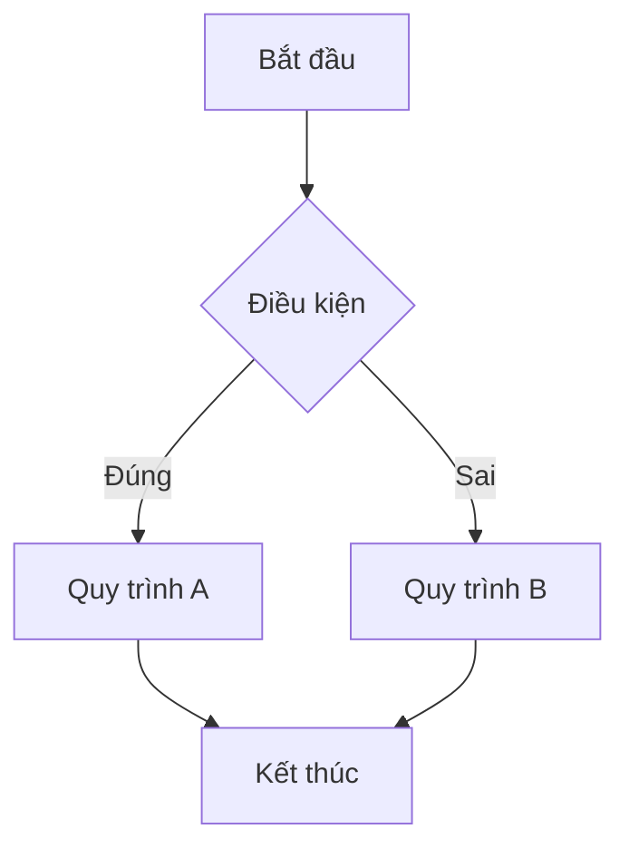

# YPVL Markdown Editor

A lightweight Markdown editor with Mermaid diagram support, built with HTML, CSS, and JavaScript.

## Features

- **Real-time Preview**: See your Markdown content rendered as you type
- **Mermaid Diagram Support**: Create flowcharts, sequence diagrams, and more using Mermaid syntax
- **Flexible View Modes**: 
  - Editor-only view
  - Preview-only view
  - Split view (default)
- **Theme Customization**: 
  - Light and Dark mode
  - Multiple color themes (Blue, Purple, Green, Red, Orange, Teal, and dark variants)
- **Document Management**:
  - Save documents to browser's local storage
  - Load documents from browser's local storage
  - Export as Markdown (.md) or HTML files
  - Print or save as PDF
- **Other Features**:
  - Example template for quick start
  - Responsive design for different screen sizes

## Project Structure

```
markdown-mermaid-editor/
├── index.html        # Main HTML file
├── styles.css        # Main CSS styles
├── print.css         # Print-specific styles
└── script.js         # JavaScript functionality
```

## How It Works

### Editor Interface

The editor has three main components:
1. The toolbar at the top with various document management options
2. The view mode selector (Editor only, Split view, Preview only)
3. The editor and preview panels

### Creating Mermaid Diagrams

To create a Mermaid diagram, use the following syntax:

````markdown

````

### Using View Modes

Use the buttons in the view mode toolbar to switch between:
- Editor Only: Focus solely on writing
- Split View: See both editor and preview side by side (default)
- Preview Only: View the final rendered output

### Changing Themes

- Click the sun/moon icon to toggle between light and dark mode
- Use the color dropdown to select a different color theme

### Managing Documents

The Document dropdown offers several options:
- Save to browser: Save your current document to local storage
- Open from browser: Load a previously saved document
- Download as Markdown: Export as .md file
- Download as HTML: Export as .html file with styling
- Print/PDF: Print your document or save as PDF

## Dependencies

The editor uses:
- [Marked.js](https://marked.js.org/) - For Markdown parsing
- [Mermaid.js](https://mermaid-js.github.io/mermaid/) - For diagram generation

These are loaded from CDN when the application starts.

## Browser Compatibility

The editor should work in all modern browsers that support:
- ES6 JavaScript
- CSS Variables
- Local Storage

## Installation

1. Clone the repository:
```
git clone https://github.com/yourusername/markdown-mermaid-editor.git
```

2. Open index.html in your web browser

No build process or server required.

## License

This project is free to use and modify.

---

Feel free to customize this README to include your name and GitHub information.
